Muhammad Ilma Yusrian Fahmi 
2409106079

PENJELASAN PROGRAM

Core Manager adalah aplikasi manajemen inventaris dan kasir sederhana untuk komponen komputer. Aplikasi ini menggunakan 
ArrayList sebagai struktur data dinamis untuk mengelola penyimpanan stok barang dan mencatat riwayat transaksi secara 
real-time

FITUR PROGRAM

- Menambah Data Part Komputer, menambahkan objek baru ke ArrayList
- Menampilkan Data Part Komputer dengan format tabel
- Mengubah Harga Part Komputer berdasarkan indeks barang
- Melakukan Penjualan Part Komputer dan menampilkan Struk Penjualan
- Menghapus Data Part Komputer
- Melihat Riwayat Penjualan yang sudah dilakukan

OUTPUT PROGRAM

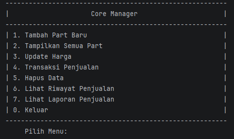
- Menampilkan Main Menu

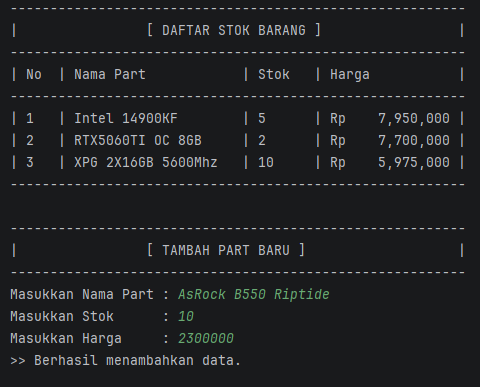
- Menu Tambah Part, dilakukan dengan memasukkan nama part, jumlah stok, dan harga

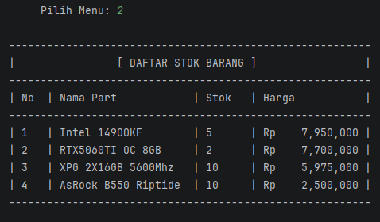
- Menu Tampilkan Semua Part

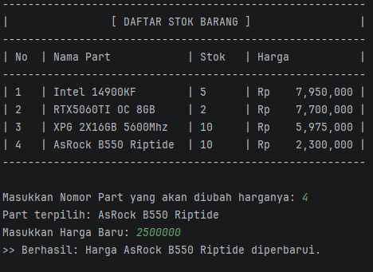
- Menu Update Harga, dilakukan dengan cara memilih nomor part lalu memasukkan harga baru

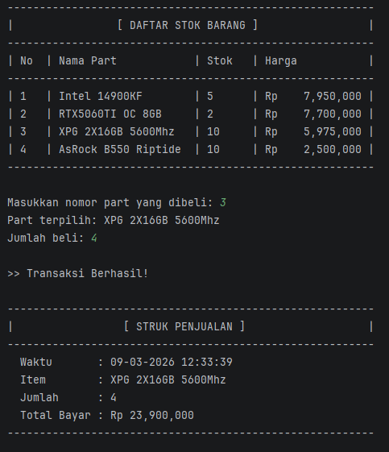
- Menu Transaksi Penjualan. dilakukan dengan cara memilih part yang ingin dibeli lalu masukkan jumlah beli, program akan
menampilkan struk penjualan yang berisi waktu beli secara real time, nama item, jumlah item, dan total bayar

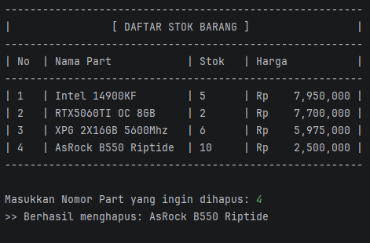
- Menu Hapus Part

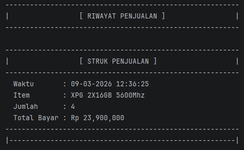
- Menu Lihat Riwayat Penjualan

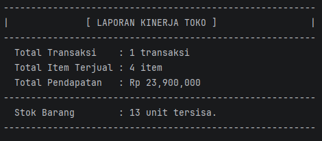
- Menu Lihat Laporan Penjualan

CLASS YANG DIGUNAKAN

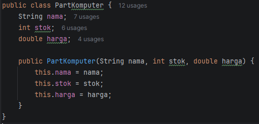
- Class PartKomputer digunakan untuk menampung objek part komputer, dalam class PartKomputer terdapat atribut nama,
stok, dan harga. Lalu terdapat juga sebuah Constructor yang akan dijalankan ketika membuat objek baru.

  

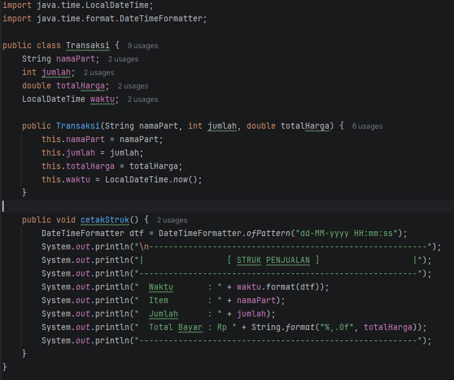
- Class Transaksi digunakan untuk menampung objek riwayat transaksi, dalam class Transaksi terdapat atribut namaPart,
jumlah, totalHarga, dan waktu. import local date time untuk mengambil waktu pada device dan format date time
untuk mengatur format jam yang akan ditampilkan. terdapat sebuah Constructor yang akan dijalankan ketika membuat objek
riwayat transaksi. method cetakStruk() digunakan untuk menampilkan tabel hasil transaksi yang dilakukan

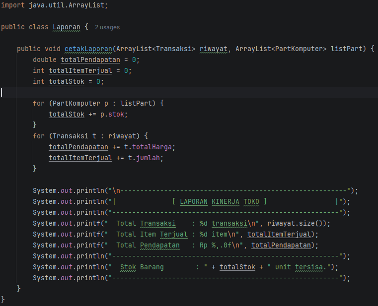
- Class Laporan berfungsi sebagai pusat pengolahan data yang bertugas untuk mengolah dan merangkum data operasional. 
Class ini tidak menyimpan data secara permanen, melainkan melakukan kalkulasi real-time terhadap data yang ada di 
program utama.

PENJELASAN KODE

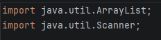
- ArrayList merupakan sebuah koleksi data yang ukurannya bisa berubah secara dinamis digunakan untuk menampung daftar 
objek partKomputer dan Transaksi
- Scanner adalah alat yang digunakan untuk mengambil input keyboard di terminal dari pengguna

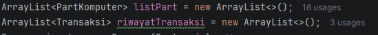
- Digunakan untuk membuat sebuah arraylist yang diisi objek dari kelas partKomputer kemudian diberi nama variabel 
listPart dan objek dari kelas Transaksi kemudian diberi nama variabel riwayatTransaksi

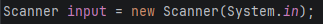
- Digunakan untuk menerima input dari pengguna dan diberi nama variabel input

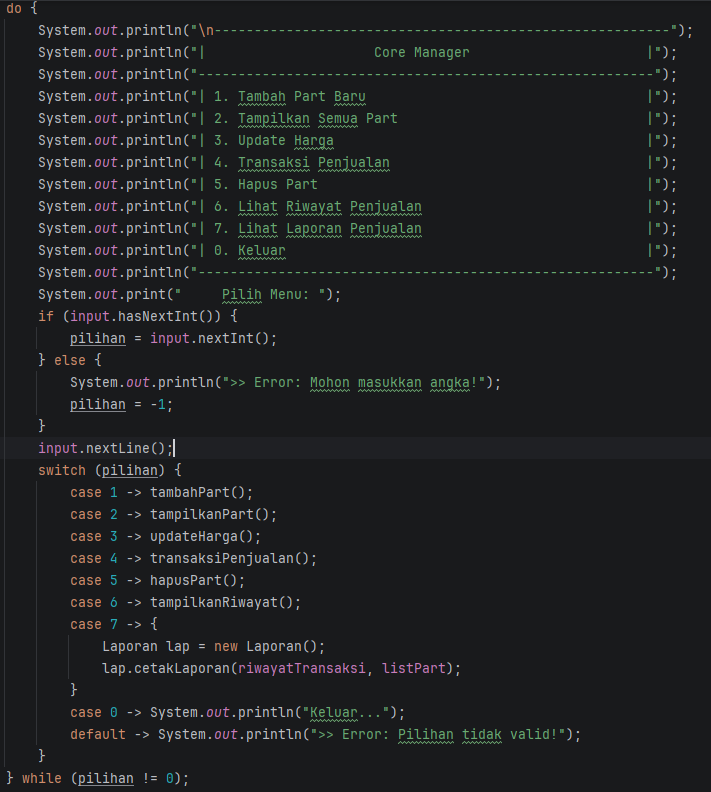
- Instansiasi objek partKomputer menggunakan Parameterized Constructor, data awal dimasukkan ke dalam ArrayList 
listPart, agar ketika program dijalankan pertama kali datanya tidak kosong

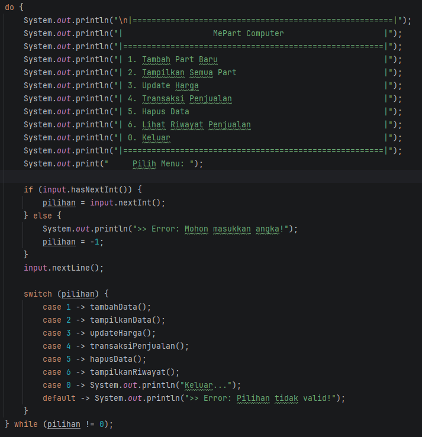
- Menggunakan perulangan do while untuk menampilkan menu utama pada sistem, jika input dari perngguna tidak 0 maka  
perulangan akan terus terjadi dan program tetap berjalan, mengguanakan switch case untuk masuk kedalam menu yang ada  
pada program. input menu menggunakan perulangan if else sebagai error handling jika input yang dimasukkan bukan angka.
- if (input.hasNextInt()) merupakan sebuah pengecekan boolean apakah input adalah integer, menggunakan nextInt() untuk 
mengkonversi atau membaca input menjadi integer. pilihan = -1 pada else diugnakan untuk membuat input yang  dimasukkan 
bukan integer menjadi -1 karna -1 tidak ada pada menu jadi program tidak berhenti karna error.
- input.nextLine() digunakan untuk menghapus buffer/newline setelah sebuah input dilakukan

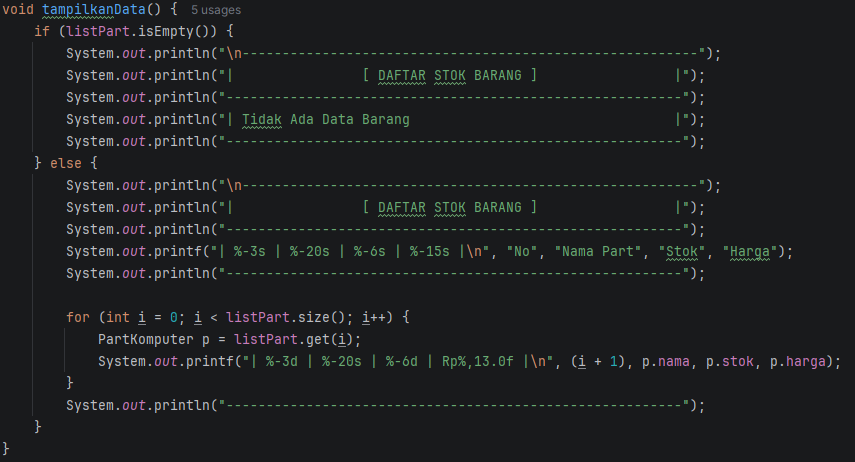
- fungsi tampilkanPart() digunakan untuk menampilkan data part dalam bentuk tabel yang tersimpan dalam listPart, 
dilakukan pengecekan kondisi menggunakan if (listPart.isEmpty()) jika data pada listPart tidak ada maka akan ditampilkan 
Tidak Ada Data Barang, System.out.printf digunakan untuk melakukan pemformatan teks terstruktur agar tampilan rapi.

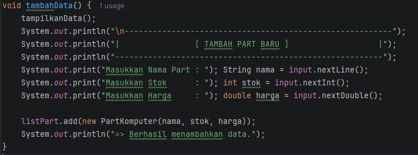
- fungsi tambahPart() digunakan untuk menambah objek baru dari class partKomputer dengan data yang sudah dimasukkan 
lalu menyimpannya ke dalam ArrayList partKomputer

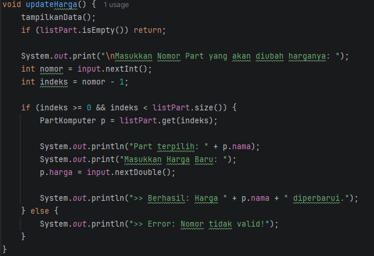
- fungsi updateHarga() digunakan untkk mengubah harga dari objek yang ada di class partKomputer, menggunakan -1 pada 
int indeks = nomor - 1; karna indeks di ArrayList dimulai dari 0. if (indeks >= 0 && indeks < listPart.size()): 
digunakan untuk memastikan bahwa nomor yang dimasukkan berada di dalam rentang data yang ada. Jika Benar maka objek  
barang dengan listPart.get(indeks), menampilkan nama barang, lalu meminta input harga baru (nextDouble()). Lalu harga 
diperbarui menggunakan method setHarga(hargaBaru).

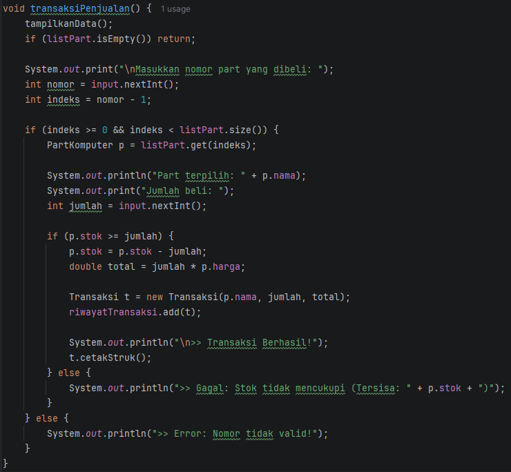
- fungsi transaksiPenjualan() menanangani proses pengecekan stok dan pencatatan riwayat transaksi. pertama dilakukan 
pengecekan apakah nomor part yang dimasukkan ada pada listPart, PartKomputer p = listPart.get(indeks); variabel p adalah 
sebuah variabel referensi untuk mengakses objek di dalam listPart. lalu dilakukan pengecekan kondisi ketika memasukkan 
jumlah yang ingin dibeli dengan stok yang ada dalam objek listPart, jika cukup maka akan dilanjutkan dengan perhitungan 
total harga dan jumlah beli, lalu dilakukan pencatatan. Objek Transaksi dibuat dan dimasukkan ke dalam riwayatTransaksi.

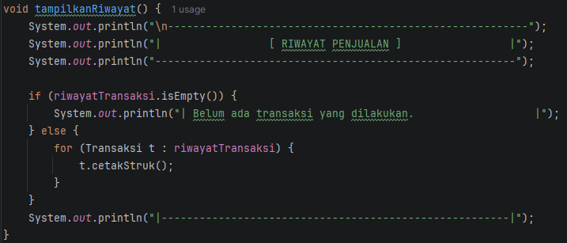
- fungsi tampilkanRiwayat() menampilkan semua data yang ada di dalam ArrayList riwayatTransaksi menggunakan perulangan 
for each

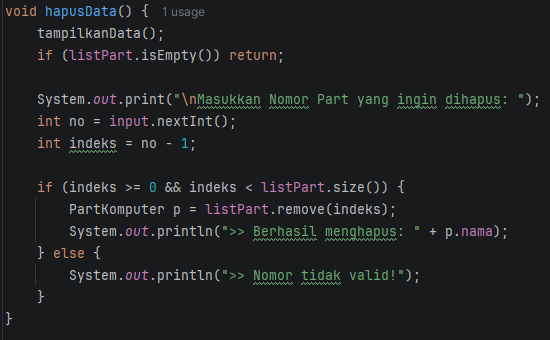
- fungsi hapusPart() digunakan untuk menghapus data yang ada dalam ArrayList partKomputer dengan menggunakan indeks nya

