B2 2409106079 Muhammad Ilma Yusrian Fahmi

TAMPILAN UTAMA PROGRAM

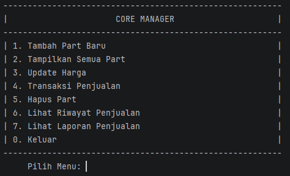

TAMPILAN MENU TAMBAH PART BARU

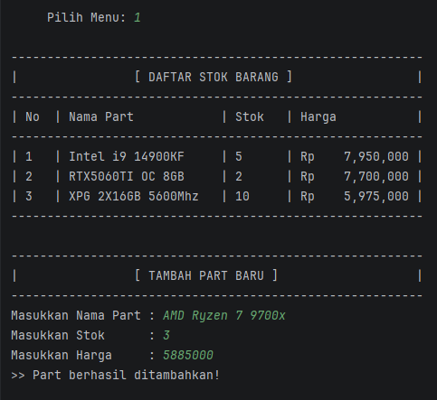

TAMPILAN MENU TAMPILKAN DAFTAR PART

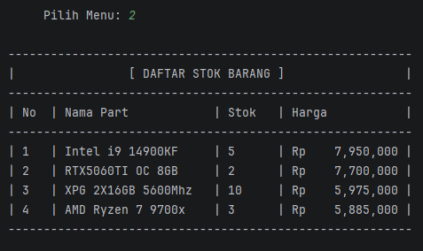

TAMPILAN MENU UPDATE HARGA

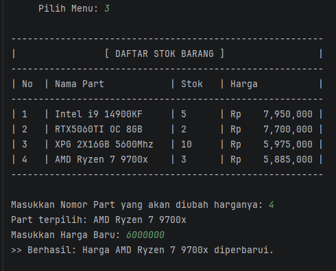

TAMPILAN MENU TRANSAKSI

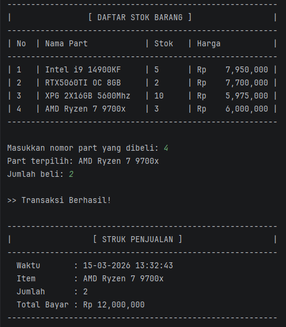

TAMPILAN MENU HAPUS PART

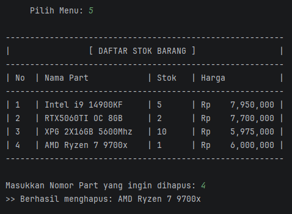

TAMPILAN MENU LIHAT RIWAYAT PENJUALAN 

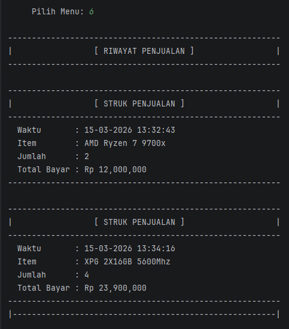

TAMPILAN MENU LIHAT LAPORAN PENJUALAN

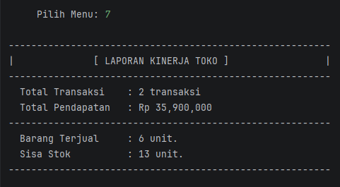

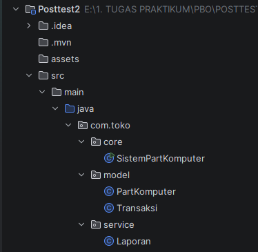

Menggunakan build tools Maven, dan membagi menjadi 3 package (core, model, dan service).

Menggunakan Atribut modifier private untuk mencegah perubahan data yang tidak sah dan
menerapkan konsep encapsulation

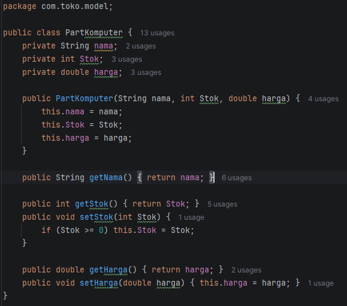

Class PartKomputer Menggunakan Atribut modifier private, dan menggunakan getter untuk mengambil nilai,
setter untuk mengubah nilai, dan menggunakan method dengan  access modifier public agar bisa digunakan oleh class lain

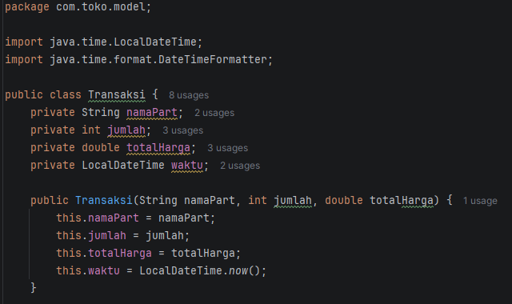
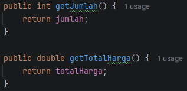

Class Transaksi Menggunakan Atribut modifier private, dan menggunakan getter untuk mengambil nilai,dan menggunakan 
method dengan  access modifier public agar bisa digunakan oleh class lain

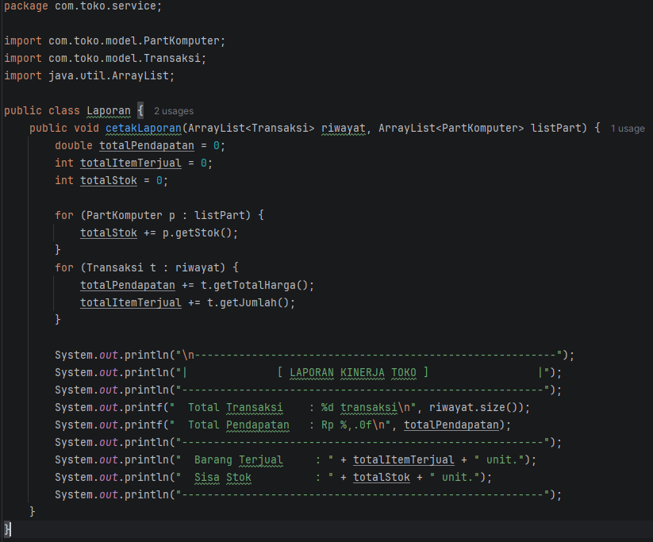

Class Laporan hanya digunakan sebagai tempat untuk menghitung dan tidak menyimpan data

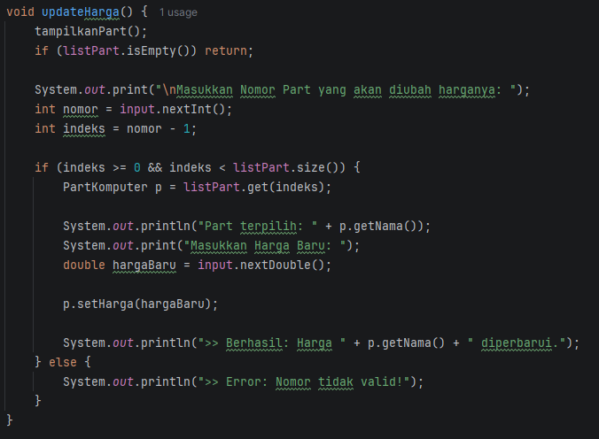
tidak seperti sebelumnya dimana ketika ingin mengambil suatu nilai langsung dengan p.nama(), sekarang harus menggunakan
p.getNama() karna atribut nya sudah menjadi private, dan untuk mengubahnya juga harus menggunakan p.setHarga(hargabaru) 
yang  sebelumnya langsung dengan p.harga = hargaBaru. begitupun pada fungsi fungsi lainnya harus menggunakan getter dan
setter jika ingin mengambil dan mengubah nilai.