B2 2409106079 Muhammad Ilma Yusrian Fahmi

TAMPILAN UTAMA PROGRAM

TAMPILAN MENU TAMBAH PART BARU

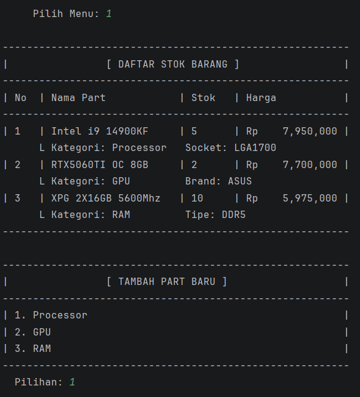

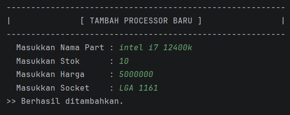

TAMPILAN MENU TAMPILKAN DAFTAR PART

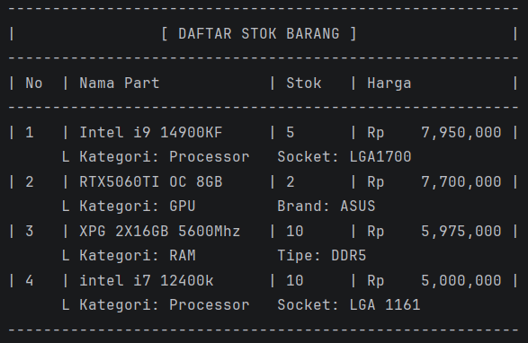

TAMPILAN MENU UPDATE HARGA

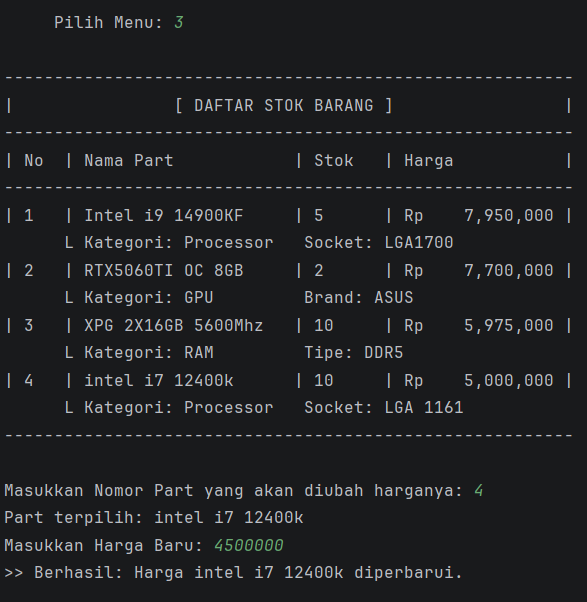 

TAMPILAN MENU TRANSAKSI

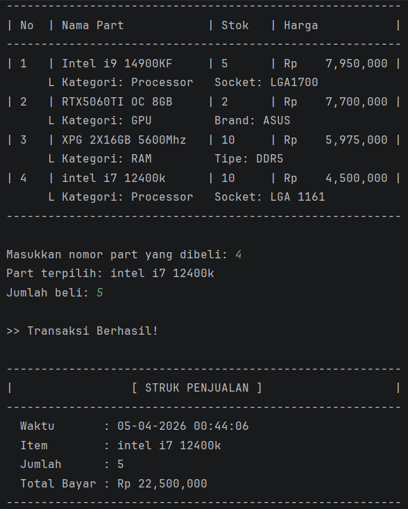

TAMPILAN MENU HAPUS PART

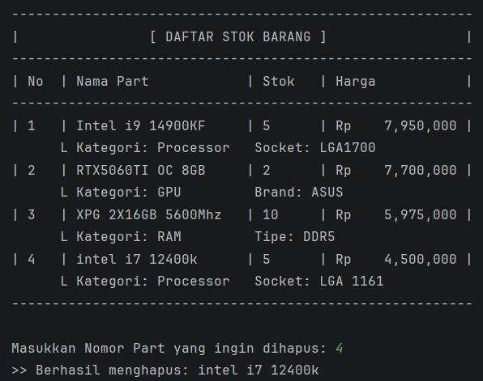

TAMPILAN MENU LIHAT RIWAYAT PENJUALAN 

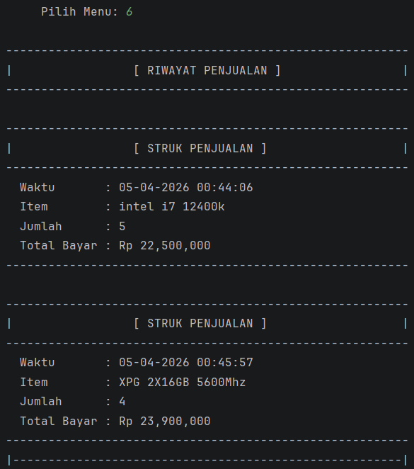

TAMPILAN MENU LIHAT LAPORAN PENJUALAN

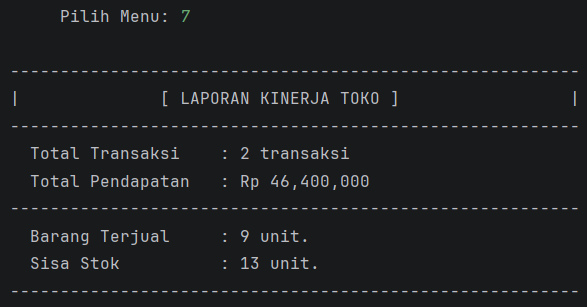

menerapkan konsep pewarisan data dan method dari class yang sudah ada pada class yang baru. Pada program ini menggunakan Hierarchical Irheritance yaitu tipe pewarisan di mana satu Superclass (Induk) diwarisi oleh lebih dari satu Subclass (Anak)

Class PartKomputer menjadi parent yang mewarisi nama, stok, dan harga dan menggunakan method tampilkanSpesifikasi menggunakan
get.Class().getSimpleName() untuk mendeteksi kategori yang diambil dari nama class secara otomatis
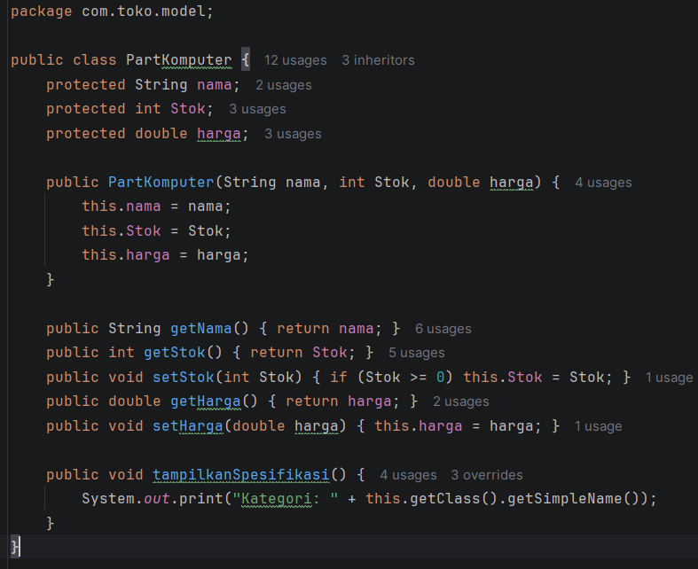

class gpu, processor, dan ram menjadi child dari class PartKomputer dan Menggunakan super.tampilkanSpesifikasi() untuk 
mengambil teks kategori dari parent, lalu menyambungnya dengan detail unik masing-masing (seperti Socket atau VRAM)

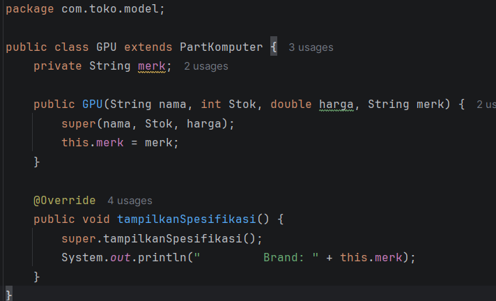
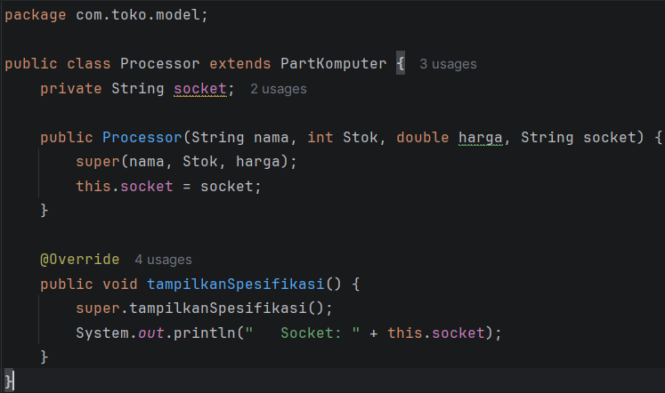
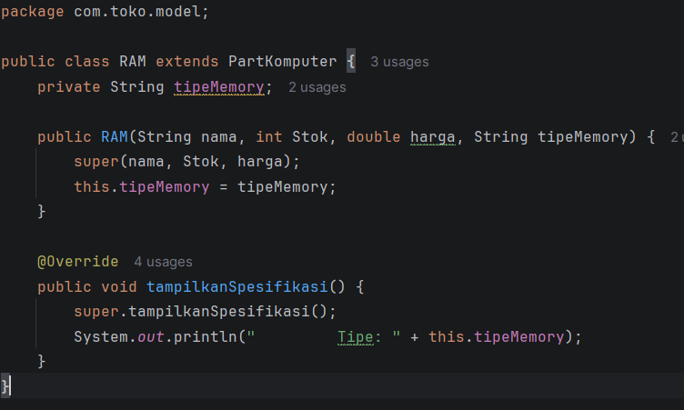
