B2 2409106079 Muhammad Ilma Yusrian Fahmi

TAMPILAN UTAMA PROGRAM

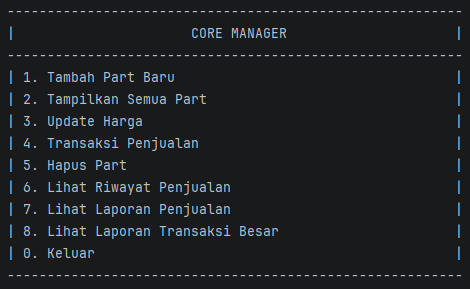

TAMPILAN MENU BARU LIHAT LAPORAN TRANSAKSI BESAR

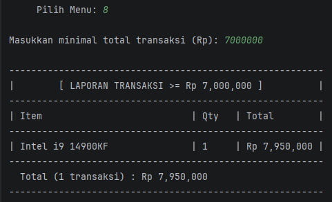

menerapkan konsep Polymorphism merupakan sebuah konsep OOP di mana class memiliki
banyak “bentuk” method yang berbeda, meskipun namanya sama. Maksud dari “bentuk”
adalah isinya yang berbeda, namun tipe data dan parameternya sama.

METHOD OVERRIDING

Class PartKomputer

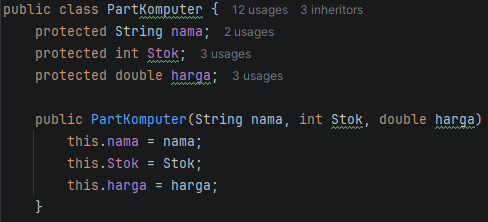

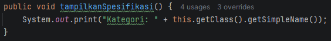

contoh nya disini adalah part komputer memiliki atribut nama, stok, dan harga dan method tampilkan spesifikasi untuk
menampilkan class nya sendiri

Class Processor

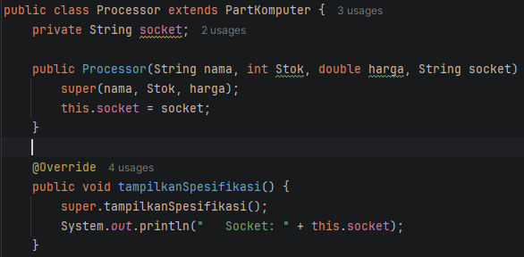
pada class processor akan digunakan atribut dari part komputer seperti nama, stok, dan harga, kemudian menambahkan 
atribut milik processor yaitu socket, lalu meng override method dari part komputer untuk menampilkan classnya sendiri 
yaitu processor dan menampilkan detail uniknya sendiri yaitu socket

Class GPU

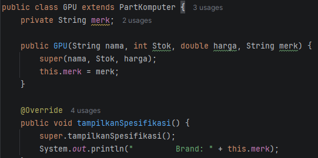

begitupun pada GPU, menggunakan atribut turunan dari partkomputer nama, stok, dan harga, kemudian menambahkan
atribut milik GPU yaitu merk, alu meng override method dari part komputer untuk menampilkan classnya sendiri yaitu GPU
dan menampilkan detail uniknya sendiri yaitu merk

Class RAM

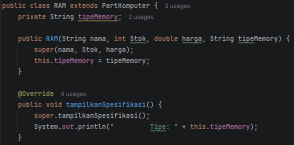

pada ram menambahkan atribut socket, dan menampilkannya

OUTPUT

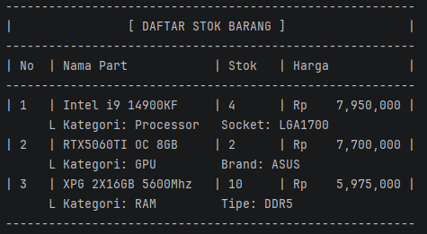

METHOD OVERLOADING

Class Laporan

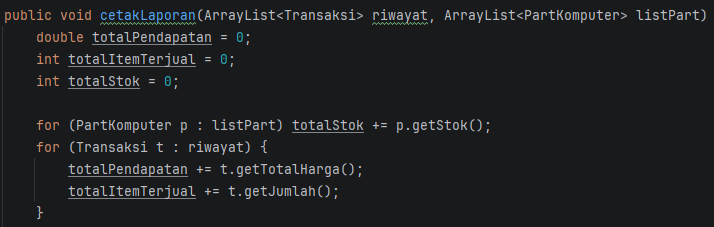

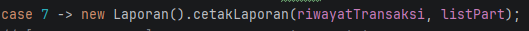

pada method cetakLaporan pertama ini memiliki 2 parameter untuk menampilkan semua transaksi yang ada dan menampilkan 
stok barang yang tersisa dari listPart

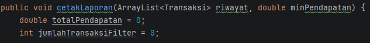

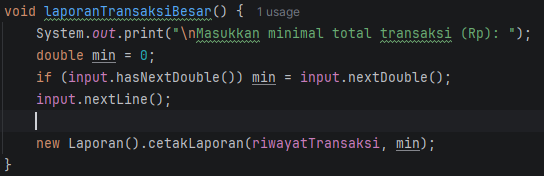

dan pada method cetakLaporan kedua memiliki parameter untuk menampilkan riwayat dan yang berbeda yaitu min, untuk
mencari minimal transaksi yang dilakukan.

