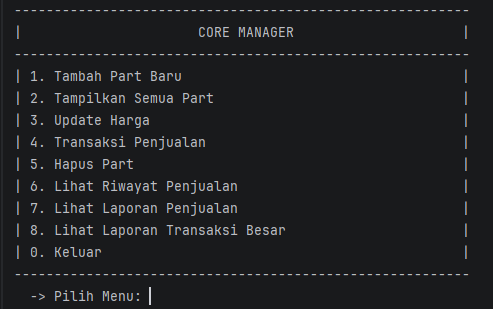
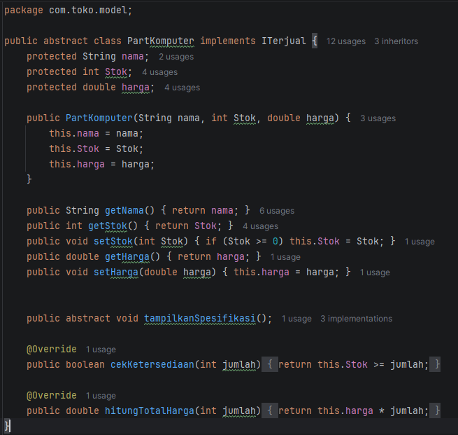
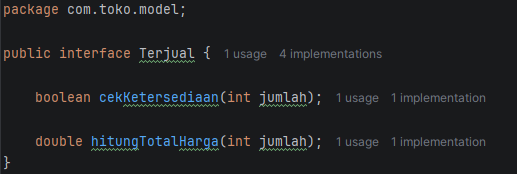
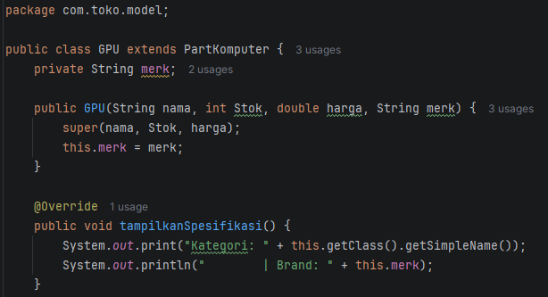
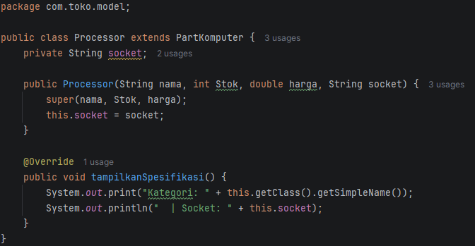
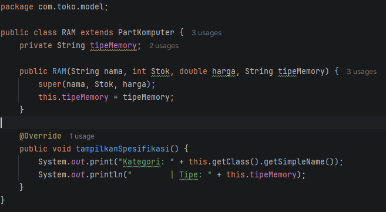
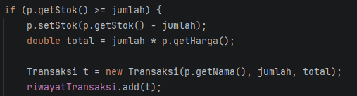
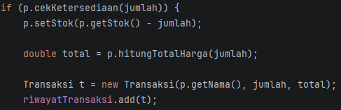

B2 2409106079 Muhammad Ilma Yusrian Fahmi

TAMPILAN UTAMA PROGRAM

Menerapkan Abstraction yang merupakan sebuah proses untuk menyembunyikan detail implementasi atau proses kompleks suatu
objek, dan hanya menampilkan fungsi esensial dan fungsional. dan menerapkan Interface yaitu sebuah cara untuk menerapkan
abstraction dengan cara membuat method tanpa menyertakan body method tersebut.

CLASS PARENT PartKomputer

class PartKomputer diubah menjadi Abstract Class dengan menambah keyword abstract pada deklarasi class dan terdapat
abstract method tampilkanSpesifikasi() tanpa body sehingga subclass wajib mengimplementasikannya. Class PartKomputer
juga meng implement Interface Terjual yang jika dianalogikan harus mengiplementasikan apa yang ada pada interface 
Terjual. Meng Override method cekKetersediaan() menghitung stok part apakah cukup untuk jumlah yang dibeli mengembalikan
True jika cukup dan False jika tidak, dan method hitungTotalHarga() menghitung total harga pembelian berdasarkan jumlah
unit dikalikan dengan harga satuan

Pada Interface Terjual terdapat 2 method cekKetersediaan()dan method hitungTotalHarga, sehingga pada
class PartKomputer harus ada 2 method tersebut

SUB CLASS GPU

Karna method tampilkanSpesifikasi() sekarang menjadi abstract method, setiap subclass tidak memanggil 
super.tampilkanSpesifikasi() yang sudah memiliki body, subclass GPU sekarang mengimplementasikan method itu sendiri 
secara lengkap yang sebelumnya hanya mengisi brand nya sendiri, sekarang kategori juga diambil langsung dari class GPU

SUB CLASS Processor

SUB CLASS RAM

Begitu pula pada class Processor dan RAM sekarang juga mengambil kategori langsung dari class nya sendiri dan mengisi
atribut unik mereka sendiri.

Method Interface Pada SistemPartKomputer

Sebelum menggunakan Method dari Interface

Sesudah menggunakan Method dari Interface

Sebelumnya class SistemPartKomputer harus mengecek stok dan menghitung total harga sendiri, setelah menggunakan method 
dari Interface yang melakukan pengecekan stok adalah objeknya seperti GPU, RAM, dan Processor, dan lalu yang menghitung
total harga adalah class PartKomputer. Class SistemKomputer tidak perlu tau cara hitungnya bagaimana hanya perlu hasilnya
saja
